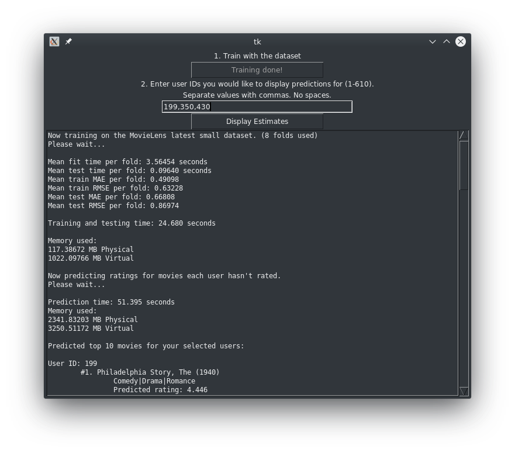

# Movie rating prediction
A project for COMP6/4118 in Spring 2019.

By David Reddick and Thomas Goodman.

This project uses Surprise and the SVD algorithm to demonstrate collaborative filtering on the MovieLens latest small dataset. The top 10 movies for users are predicted based on their rating history and how other users have rated the movies.

## Setup instructions

You will need to have Python 3 installed on your system.

Run this command to install a few extra dependencies:
```
pip3 install numpy psutil scikit-surprise tkinter
```
You may also need to install the `python3-tk` (Debian/Ubuntu) or `python3-tkinter` (Fedora) packages. On Windows, it can be installed with the "tcl/tk and IDLE" check box under optional features in the Python 3 installer.

## Usage

This project uses a single Python script. Run it with `python3 predict.py` Any other usage instructions are shown in the GUI.


